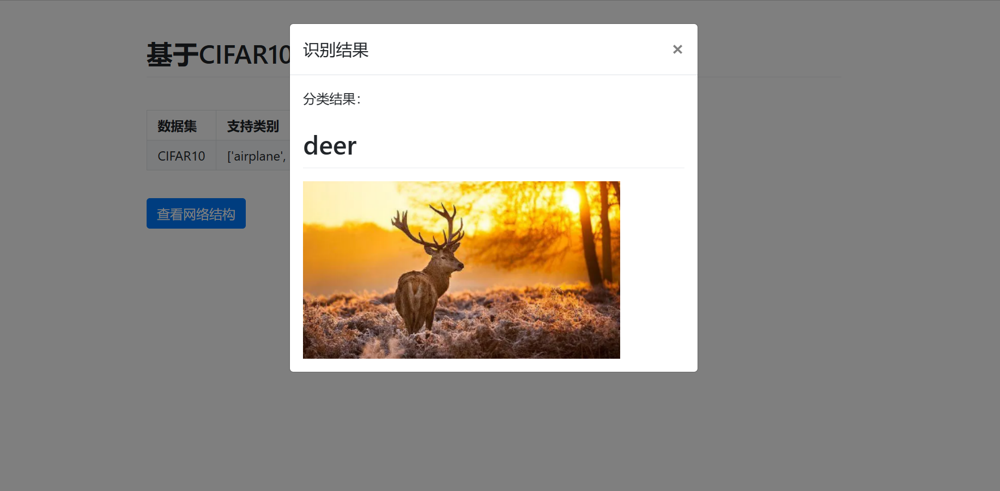
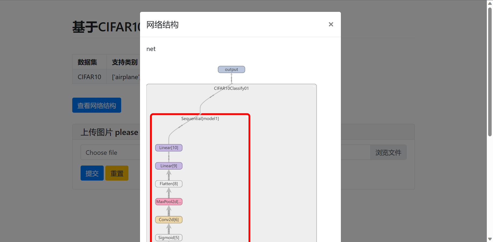
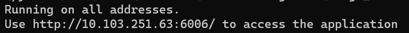

# Image_Classify_WebGUI_CIFAR10

✨**Intelligent Image Classification Web Applcation based on Convolutional Neural Networks and the CIFAR10 Dataset** : Image classification visualization interface, image classification front-end web page, image classification Demo display-Pywebio. AI artificial intelligence image classification-Pytorch. CIFAR10 dataset, small model. 100% pure Python code, lightweight, easy to reproduce.

[简体中文文档](./README.md)

[Personal website: www.bytesc.top](http://www.bytesc.top) includes online project demonstrations.

[Personal blog: blog.bytesc.top](http://blog.bytesc.top) 

🔔 If you have any project-related questions, feel free to raise an `issue` in this project, I will usually reply within 24 hours.

## Project Introduction
* 1. Use pytorch to implement intelligent classification of CIFAR10 dataset images
* 2. Use a small model, lightweight, with a 76% accuracy rate
* 3. Use pywebio as the web visualization framework, no need for front-end language, written in pure python. Lightweight, easy to reproduce, easy to deploy

Network structure used


## Screenshot of the effect




## How to use
Python version 3.9

First install dependencies
> pip install -r requirement.txt

modelDemo.py is the project entry point, run this file to start the server
> python modelDemo.py

Copy the link to the browser and open it

Click "Demo" to enter the Web interface


After that, you can also click "Upload File" and select an image file from the example_img folder to upload and test

## Project structure
```
└─Image_Classify_WebGUI_CIFAR10
    ├─data
    │  └─logs_import 
    ├─example_img
    ├─process
    │  └─logs
    └─readme_static
```
* The data folder stores some static resources, including the trained model.pth
* The process folder stores some process files, including the model training program, etc.
* readme_static stores static resources used in the readme document
* The example_img folder contains some images that can be used for testing