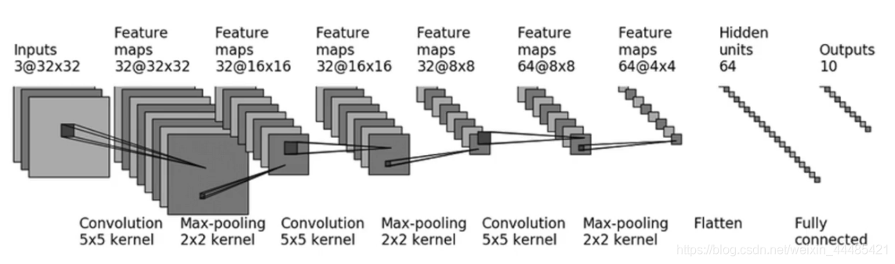
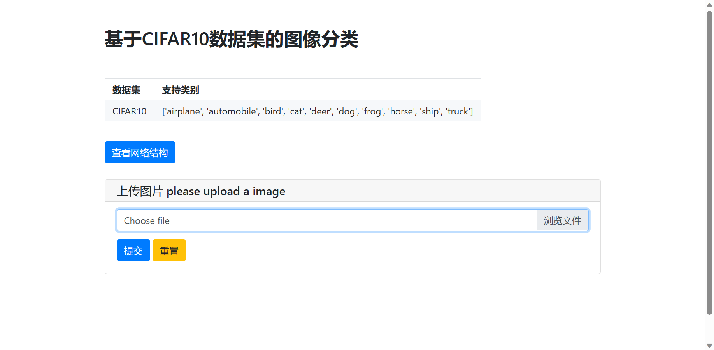
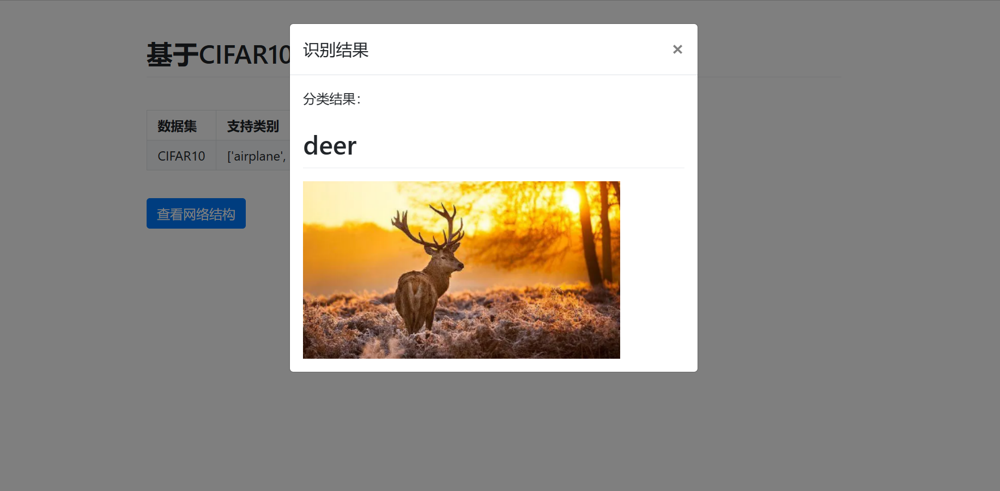
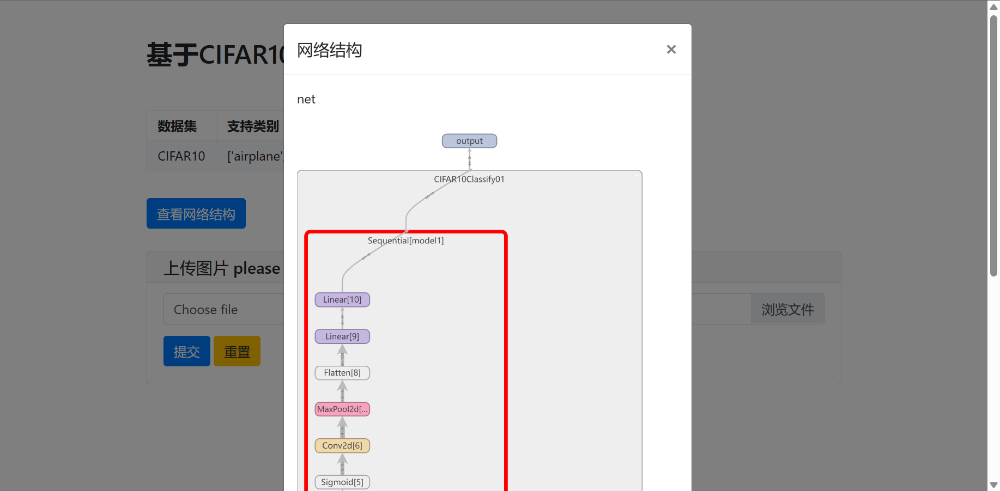
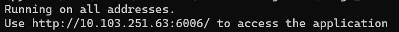

# Image_Classify_WebGUI_CIFAR10

基于CIFAR10的图像分类：图像分类可视化界面，图像分类前端网页，图像分类Demo展示-Pywebio。AI人工智能图像分类-Pytorch。CIFAR10数据集，小模型。100%纯Python代码，轻量化，易复现 

[个人网站：www.bytesc.club](http://www.bytesc.club) 包含项目在线演示。

## 项目简介
* 1, 使用pytorch实现CIFAR10数据集图片的智能分类
* 2, 使用小模型，轻量化，76%准确率
* 3，使用pywebio作为web可视化框架，无需前端语言，使用纯python编写。轻量化，易复现，易部署

使用的网络结构


## 效果截图




## 如何使用
python版本3.9

先安装依赖
> pip install -r requirement.txt

modelDemo.py是项目入口，运行此文件即可启动服务器
> python modelDemo.py

复制链接到浏览器打开
 
点击”Demo“即可进入Web界面


之后，也可以点击“上传文件”，选择example_img文件夹内图片文件上传测试

## 项目结构
```
└─Image_Classify_WebGUI_CIFAR10
    ├─data
    │  └─logs_import 
    ├─example_img
    ├─process
    │  └─logs
    └─readme_static
```
* data文件夹存放部分静态资源，包括训练好的模型.pth
* process文件夹存放一些过程文件，包括模型的训练程序等
* readme_static存放readme文档中用的静态资源
* example_img文件夹内存放了一些图片，可用于测试

# 开源许可证

此翻译版本仅供参考，以 LICENSE 文件中的英文版本为准

MIT 开源许可证：

版权所有 (c) 2023 bytesc

特此授权，免费向任何获得本软件及相关文档文件（以下简称“软件”）副本的人提供使用、复制、修改、合并、出版、发行、再许可和/或销售软件的权利，但须遵守以下条件：

上述版权声明和本许可声明应包含在所有副本或实质性部分中。

本软件按“原样”提供，不作任何明示或暗示的保证，包括但不限于适销性、特定用途适用性和非侵权性。在任何情况下，作者或版权持有人均不对因使用本软件而产生的任何索赔、损害或其他责任负责，无论是在合同、侵权或其他方面。
